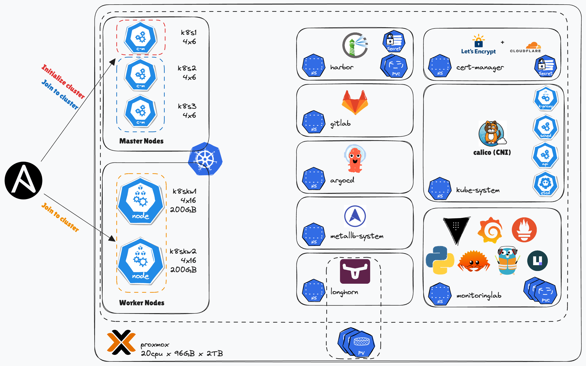

# Monitoring Lab: K8s

Successor to the [Docker Compose based monitoring lab](https://github.com/hortonew/monitoring-lab), this time in Kubernetes, hosted on my Proxmox server.



## ArgoCD

```sh
kubectl create namespace argocd
kubectl apply -n argocd -f https://raw.githubusercontent.com/argoproj/argo-cd/stable/manifests/install.yaml

# Bootstrap the cluster (or go in order 0-n)
kubectl apply -f argocd-apps/

# Make argocd accessible via MetalLB once it's set up
kubectl patch svc argocd-server -n argocd -p '{"spec": {"type": "LoadBalancer"}}'
kubectl annotate svc argocd-server -n argocd "external-dns.alpha.kubernetes.io/hostname=argocd.lab.hortonew.com"
kubectl -n argocd get secret argocd-initial-admin-secret -o jsonpath="{.data.password}" | base64 -d

# Set up necessary secrets for cert-manager and external-dns
kubectl create secret generic cloudflare-api-token-secret --from-literal=api-token=<secret here> -n cert-manager
kubectl create secret generic cloudflare-api-token-secret --from-literal=api-token=<secret here> -n external-dns 

# Configure cert for harbor
HARBOR_LB_IP=$(kubectl get svc -n harbor harbor -o jsonpath='{.status.loadBalancer.ingress[0].ip}')
openssl req -newkey rsa:2048 -nodes -keyout harbor-tls.key -x509 -days 365 -out harbor-tls.crt -subj "/CN=harbor.lab.hortonew.com" -addext "subjectAltName=DNS:harbor.lab.hortonew.com,IP:$HARBOR_LB_IP"
kubectl create secret tls harbor-tls --cert=harbor-tls.crt --key=harbor-tls.key -n harbor
```

## Vault

Follow instructions in [apps/vault/README.md](apps/vault/README.md).  When first initializing vault, you'll need to set up the cluster and edit a kubernetes secret for the unlock keys.  After that, a cronjob will automatically unlock vault if it goes down.  You can also trigger this job manually for quicker unlock during maintenance.

<!-- ## Gitlab

helm upgrade --install gitlab gitlab/gitlab --namespace gitlab --create-namespace -f k8s-configs/git-and-container-registry/gitlab-values.yml --timeout 600s -->